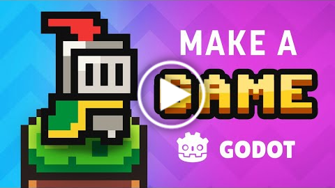
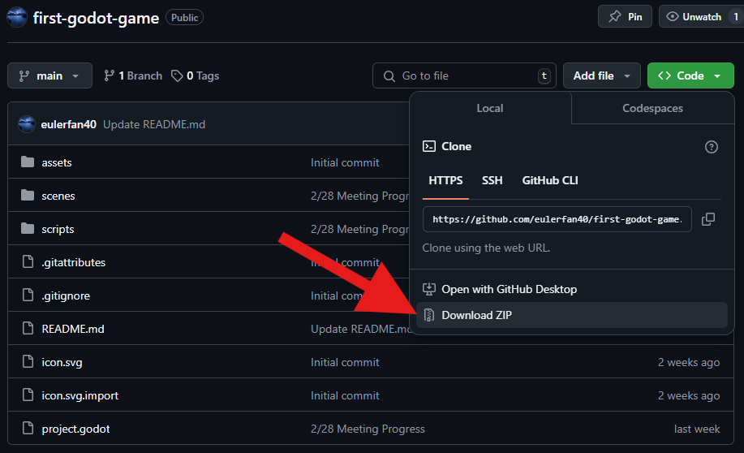
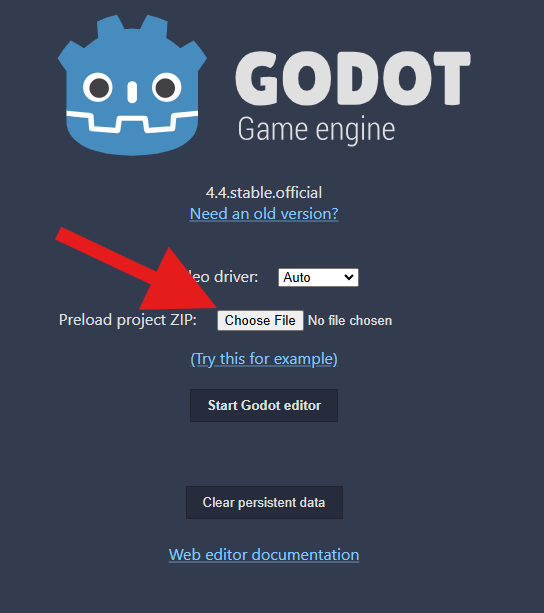
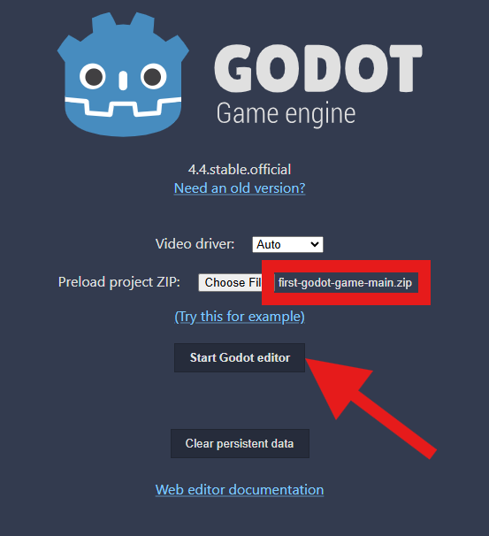
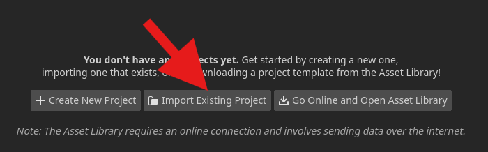
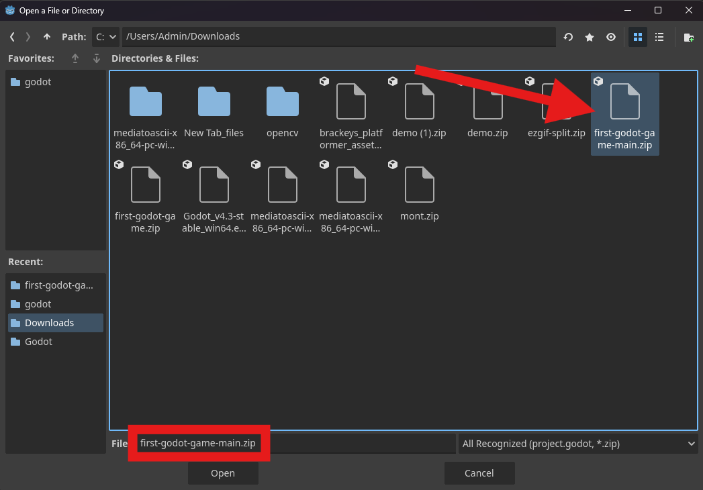

# First Godot Game - Info and Help

## Resources  

Godot offers a [web editor](https://editor.godotengine.org/releases/latest/), or you can [download it](https://godotengine.org/download/windows/) for Windows, Mac and Linux.

### Main Curriculum  

### Useful Links  

Finished Project Target: 
- [Brackeys First Game in Godot](https://github.com/Brackeys/first-game-in-godot)

Support:  
- [Google](https://www.google.com)  
- [YouTube](https://www.youtube.com)  
- [GDQuest Godot Tutorials](https://www.gdquest.com/tutorial/godot/)  
- [Godot 2D Tutorials](https://docs.godotengine.org/en/stable/tutorials/2d/index.html)  
- [Godot Forum](https://forum.godotengine.org/)  

Free Assets:
- [Itch.io](https://itch.io/)
- [OpenGameArt](https://opengameart.org/)
- [Kenney.nl](https://kenney.nl/)

## Progress

- **2/21 Meeting:** Up till **23:30** in the video curriculum below, plus some animations. 
    * Added the player character with follow camera and WASD + arrow key movement. Added all player animations, although only idle is implemented. Created a tileset and set up a basic world tilemap.

- **2/28 Meeting:** Up till **50:06**, minus implementing the background.
    * Added functionality for moving or stationary platforms, which have one-directional collision. Added animated coins which disappear upon pickup. Added functionality for killzones which reload the scene after a short timer, to be used for enemies, spikes, etc. Implemented the killzone in a bottom bound, which also stops the camera from falling endlessly. Added all three enemy animations, although only idle is implemented, and the enemy movement system, which changes the direction of the enemy every time it hits a wall.

- **3/7 Meeting:** Up till **1:05:50**, plus the foundation for implementation of the death animation.
    * Added a killzone to the enemy, as well as behavior to flip the sprite to face the direction its moving. Improved the death effect with slow motion and the player falling through the world. Implemented the jump and run animations, as well as the framework for the death animation. Added player sprite flipping similar to the enemy sprite flip. Added on-screen text hints. Created a game manager which manages the score and will manage the player life status for the death animation.

- **3/14 Meeting:** Up till the **end of the tutorial**, plus more adaptive enemy movement, minus implementing music and exporting. 
    * Completed final worldbuilding. Added in-game text which displays your score. Added coin pickup SFX. Added raycasts to the enemy to check if it's on the ground or not, so it can detect if it's falling off a ledge and change directions.

### Going Forward

Some additional things that can be done individually:
* Finish implementing the death animation.
* Implement a rolling functionality with animation and a smaller collider.
* Implement spikes with a tilemap.
* Implement a health system with pickups for regeneration.
* Implement the remainder of the sound effects.
* Export to WebGL, Windows, Mac, and Linux. Explore adding your WebGL build to your personal website.

### How to Sync Your Progress

**Step 1: Download the project files from the GitHub repository as a .zip.**

**Step 2: Import the project into Godot.**

If using the web editor:

If using the desktop application:

